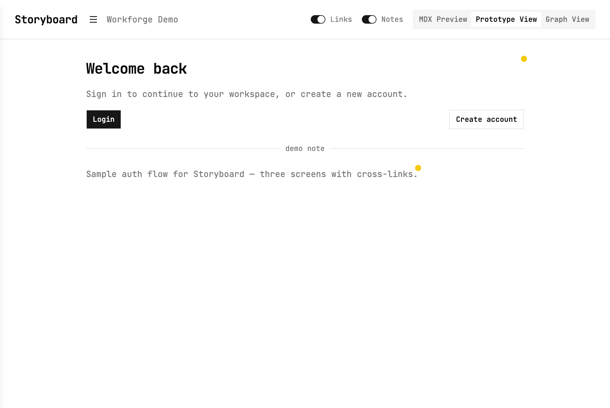
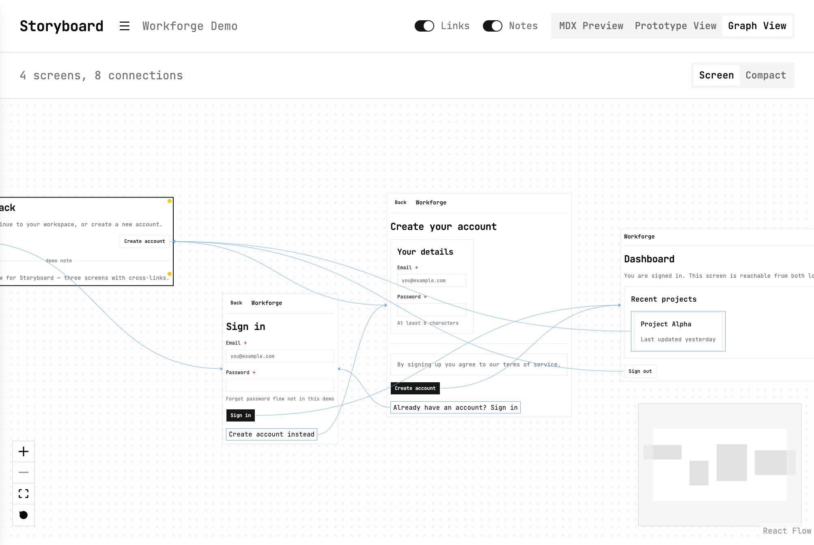

# Storyboard

**Text-first UX specification via MDX + React components.**

Describe screens, actions, and navigation in code — not mockups. One MDX source drives **Preview**, **Prototype**, and **Graph View**. Think Storybook for UX flows.

**Live demo:** [zeshangit.github.io/Storyboard](https://zeshangit.github.io/Storyboard/)

## Screenshots

**Prototype View** — clickable flow from MDX (Workforge Demo):



**Graph View** — auto-generated navigation graph from the same MDX:



## What it is

Storyboard lets you specify:

- What is visible on each screen
- What actions are available
- Where actions navigate
- How screens connect

Primitives render as structural wireframes (borders, semantic HTML). The shell uses Tailwind/shadcn for chrome. The goal is **intent over appearance** — not pixel-perfect design or a Figma replacement.

## Quick start

```bash
npm install
npm run dev    # http://localhost:5173 — codegen on start + MDX save
```

Author specs in `src/content/*.mdx`. Do not hand-edit `src/generated/` (auto-generated, gitignored).

```yaml
---
title: My App Flow
---
```

Demo documents:

| File | Purpose |
|------|---------|
| [`storyboard.mdx`](src/content/storyboard.mdx) | Intro and how the tool works |
| [`wireframe.mdx`](src/content/wireframe.mdx) | Workforge auth demo (login → dashboard) |
| [`components.mdx`](src/content/components.mdx) | Component catalog |

## Example

```mdx
---
title: Workforge Demo
---

<Screen id="home" title="Home">
  <Text h1>Welcome back</Text>
  <Link goto="login">Login</Link>
  <Link goto="signup" primary-btn>Create account</Link>
</Screen>

<Screen id="login" title="Login">
  <TopBar title="Workforge" showBack />
  <Container>
    <Text h1>Sign in</Text>
    <Input label="Email" placeholder="you@example.com" required />
    <Input label="Password" type="password" required />
    <Link goto="dashboard" primary-btn>Sign in</Link>
  </Container>
</Screen>
```

No imports in MDX — components are registered globally. Save the file and codegen updates routes, screens, and the navigation graph automatically.

## Shell views

| View | Purpose |
|------|---------|
| **MDX Preview** | All `<Screen>` blocks stacked; in-page anchor scroll via `Link` |
| **Prototype View** | Clickable flow using generated routes (first screen = entry) |
| **Graph View** | Navigation graph with pan/zoom; Screen or Compact sub-modes |

Use the document picker (☰ menu) to switch between MDX files. `storyboard.mdx` opens first.

## MDX components

Full API: [`docs/MDX-COMPONENTS.md`](docs/MDX-COMPONENTS.md)

| Component | Key props / flags |
|-----------|-------------------|
| `Screen` | `id` (required), `title` (preview label) |
| `Link` | `goto` (required) — screen id, modal id, `_close`, or `_back`; `primary-btn`, `secondary-btn` |
| `Text` | `h1`–`h4` (one max); plain text children only |
| `Input` | `type`, `label`, `placeholder`, `hint`, `error`, `required`, `options` |
| `Container` | `row`, `border`; when row: `distribute`, `align` |
| `Image` | `aspect`: `square` \| `portrait` \| `landscape` \| `wide` |
| `Icon` | `name` (Lucide kebab-case), `size`: `sm` \| `md` \| `lg` |
| `Modal` | `id` (required); open via `Link goto`; dismiss with backdrop, Escape, or `_close` |
| `TopBar` | `title`, `showBack`; children = horizontal actions |
| `Divider` | optional `label` |

All components support `disabled`, `danger`, and `note` (yellow dot + tooltip).

**Rules:** Screen `id` unique per document. Modal `id` unique per screen and must not match a screen id. Only `<Screen>` blocks register for prototype/graph.

## How codegen works

```
src/content/*.mdx
  → extract screens + validate (dup ids, bad goto, Text flags)
  → src/generated/documents/{slug}/screens.generated.tsx
                        routes.generated.tsx
                        navigation-graph.generated.ts
  → content-documents.generated.tsx, routes.generated.tsx
  → Preview | Prototype | Graph View
```

Codegen runs on `buildStart` and when MDX files are saved. Validation errors block the run and surface in the terminal (`[wireframe] Codegen failed: …`) and in the app shell.

## Commands

```bash
npm run dev        # dev server + codegen on MDX save
npm run build      # codegen + tsc + vite build
npm run build:pages # production build + 404.html for GitHub Pages SPA routing
npm run check      # codegen + tsc + Biome
npm run fix        # Biome safe fixes + format
npm run codegen    # regenerate src/generated/ only
npm test           # Vitest plugin tests
npm run preview    # preview production build
```

## GitHub Pages

The repo deploys to GitHub Pages on push to `master` via [`.github/workflows/deploy-pages.yml`](.github/workflows/deploy-pages.yml).

**Requirements:**

- **Public repository** (GitHub Free) — or GitHub Pro/Team if the repo stays private
- **Settings → Pages → Build and deployment → Source:** **GitHub Actions**

If deploy fails with `404` / “Ensure GitHub Pages has been enabled”, Pages is not enabled yet or your plan does not support Pages on a private repo. For a showcase demo, making the repository **public** is the simplest fix.

Setup:

1. Enable Pages: **Settings → Pages → Source → GitHub Actions**
2. Push to `master` — the workflow builds with `base: /Storyboard/` and deploys

Local preview of the Pages build:

```bash
GITHUB_PAGES=true GITHUB_REPOSITORY=ZeshanGIT/Storyboard npm run build:pages
npm run preview -- --base /Storyboard/
```

## Project layout

```
src/content/*.mdx              # UX specs (YAML frontmatter title required)
src/generated/                 # auto-generated (gitignored)
src/components/wireframe/      # MDX primitives
src/components/ui/             # shadcn
src/runtime/                   # WireframeViewContext, error provider
src/shell/                     # Preview, Prototype, Graph views
src/plugin/                    # extract, validate, generate
src/mdx-components.ts          # global MDX component registry
```

## Status

Foundation through Graph View are shipped. Current primitives: Screen, Text, Link, Input, Container, Image, Icon, Modal, TopBar, Divider. Multi-document MDX, validation, and History API prototype routing are in place.

Not yet: unreachable-screen validation, doc export, Card, List, Section, BottomNav, Tabs.

## Documentation

| Doc | Contents |
|-----|----------|
| [`docs/VISION.md`](docs/VISION.md) | Product direction and philosophy |
| [`docs/CONTEXT.md`](docs/CONTEXT.md) | Architecture, codegen flow, repo map |
| [`docs/MDX-COMPONENTS.md`](docs/MDX-COMPONENTS.md) | Minimal wireframe component API |
| [`docs/GRAPH_VIEW.md`](docs/GRAPH_VIEW.md) | Graph tab UX requirements |
| [`AGENTS.md`](AGENTS.md) | Agent/convention rules for contributors |

## Tech stack

Vite 8 · React 19 · TypeScript · MDX 3 · Tailwind 4 · shadcn · `@xyflow/react` + Dagre (Graph View) · Biome · Vitest

## Non-goals

No pixel-perfect mockups, design tooling, rich styling/animations, brand theming, or Figma replacement. Wireframes that look "designed" violate the project vision.
