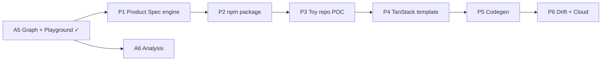

# Storyboard Roadmap

**North star:** [`VISION.md`](VISION.md) · **Product Spec:** [`PRODUCT-SPEC.md`](PRODUCT-SPEC.md) · **Repo today:** [`CONTEXT.md`](CONTEXT.md)

Two tracks:

1. **OSS wireframe shell** — MDX/JSON viewer (Preview, Prototype, Graph). Mostly shipped → [`CONTEXT.md`](CONTEXT.md)
2. **Product Spec platform** — requirements, traceability, npm, cloud POC. In progress

**Gate:** no npm publish (P2) before Product Spec code lands (P1).

## At a glance

```
OSS SHELL (shipped)          PRODUCT SPEC (next)
─────────────────────        ───────────────────
✓ A1–A5+                     ✓ P1  Schema + loader + CLI stubs
◐ A6 Analysis                ✓ P2  npm package + init
○ A7 Polish                  ○ P3  Toy repo traceability POC
                             ○ P4  TanStack Start cloud template
                             ○ P5  Implementation codegen
                             ○ P6  Drift detection + cloud product
```

✓ done · ◐ partial · ○ not started

---

## Track A — OSS wireframe shell

Phases from [`AGENTS.md`](../AGENTS.md). Shipped detail → [`CONTEXT.md`](CONTEXT.md).

| Phase | Status | Notes |
|-------|--------|-------|
| A1 Foundation | ✓ | MDX format, codegen, Preview |
| A2 Navigation | ✓ | Prototype router, Link/goto |
| A3 Primitives | ✓ | Screen–Divider; backlog: Card, List, Section, BottomNav, Tabs |
| A4 Multi-document | ✓ | `content/*.mdx`, doc picker |
| A5 Graph view | ✓ | Screen + Compact → [`GRAPH_VIEW.md`](GRAPH_VIEW.md) |
| A5+ Extensions | ✓ | JSON compiler, playground, URL state, `WireframeDocumentBundle` |
| A6 Analysis | ◐ | Unreachable/orphan/reverse-ref validation; classified links unblock — not built → [`FUTURE.md`](FUTURE.md) §3–4 |
| A7 Polish | ○ | Doc export, routes-only registry, CI codegen mode, backlog primitives |

---

## Track B — Product Spec platform

Schema + conventions: [`PRODUCT-SPEC.md`](PRODUCT-SPEC.md). Path: schema → npm → traceability POC → cloud → codegen.

### P1 · Schema + engine ✓

**Goal:** three-file Product Spec model, validation, traceability foundations.

**Status:** shipped in `src/product-spec/` ([`PRODUCT-SPEC.md`](PRODUCT-SPEC.md) 2026-06-30).

```
storyboard/spec.json           # wireframes + SR ids
storyboard/requirements.json   # SR/BR + sub-trees
storyboard/bindings.json       # BR → [screen, sr?]
```

| # | Item | Status |
|---|------|--------|
| 1 | [`PRODUCT-SPEC.md`](PRODUCT-SPEC.md) accepted | ✓ |
| 2 | Types (`StructuralReqId`, `BehavioralReqId`, `ReqPath`, `Binding`, `ProductSpec`) | ✓ |
| 3 | Loader — read three files, merge, cross-validate | ✓ |
| 4 | Tuple parser — optional SR as 2nd element | ✓ |
| 5 | CLI stubs — `req show`, `impact`, `trace`, `validate` | ✓ |
| 6 | Sample todo app JSON trio | ✓ |
| 7 | Vitest — validator + tuple parser | ✓ |
| 8 | Doc alignment — `VISION.md`, `JSON-COMPONENTS.md` SR tuples | ✓ |

Locked conventions → [`PRODUCT-SPEC.md`](PRODUCT-SPEC.md). Out of scope: npm, TanStack codegen, MDX requirements, drift detection.

**Build order:** `types.ts` → load/validate → sample JSON → Vitest → CLI (tsx) → SR tuple parser in JSON wireframe.

### P2 · npm package ✓

**Depends:** P1 complete. **Goal:** `npx storyboard` in any repo.

| Package | Role | Status |
|---------|------|--------|
| `@onespec-dev/spec` | Types, load, validate, req indexing | ✓ extracted |
| `@onespec-dev/shell` | Preview / Prototype / Graph dev server | ✓ extracted; root app dogfoods |
| `@onespec-dev/cli` | CLI bin (`storyboard`) | ✓ init, dev, validate, req, impact, trace |

```bash
npx @onespec-dev/cli init              # scaffold storyboard/
npx @onespec-dev/cli init --template cloud   # TanStack stub (P2 only)
npx @onespec-dev/cli dev | validate | req show | impact | trace
```

Init modes: **embedded** (`my-app/storyboard/` — MDX path stays in OSS) · **cloud stub** (`todo-poc/app/` + `storyboard/` JSON-only + DESIGN.md + ARCHITECTURE.md).

**Remaining:** human `npm publish -w … --access public` for `@onespec-dev/spec`, `@onespec-dev/shell`, `@onespec-dev/cli` (`onespec` bin). Dry-run gate passed. Unstable. No production codegen. npm name `storyboard` taken → ship as `@onespec-dev/cli`.

### P3 · Toy repo traceability POC ○

**Depends:** P2 (or late P1 local CLI). Separate repo, todo app, local state + Vitest.

**Pass when:** every SR → `sb-req=`; every bound BR → `// @sb-req:`; screen BRs → `{screenId}__{brPath}` tests; shared BR bound twice tested per occurrence; `storyboard trace` + `validate` pass.

**Agent playbook:** spec → CLI load reqs → DESIGN.md + ARCHITECTURE.md → spec/requirements/bindings/impl/tests — never skip req IDs.

### P4 · TanStack cloud template ○

**Depends:** P3. Stack locked: TanStack Start, React 19, shadcn, Tailwind 4, Vitest, feature folders, DESIGN.md + ARCHITECTURE.md.

Flow: spec + requirements + bindings + DESIGN.md → AI-maintained app (manual/semi-auto) → `sb-req=` + `@sb-req:` + occurrence tests. No full codegen, no Cloud SaaS yet.

### P5 · Implementation codegen ○

**Depends:** P4 proven manually. Spec → TanStack routes + page scaffolds, SR-stamped stubs, AI fills behavior. Optional React skeleton export → [`FUTURE.md`](FUTURE.md) §6.

### P6 · Drift detection + cloud ○

**Depends:** P5. Warn SR/BR mismatches vs spec. OSS: diagnostics only. Cloud: spec authoritative, AI regenerates → [`VISION.md`](VISION.md).

---

## Backlog + long-term

Unscheduled OSS ideas → [`FUTURE.md`](FUTURE.md). Cloud vs OSS products → [`VISION.md`](VISION.md).

---

## Dependencies



---

## Current focus

**Here:** P2 complete — publish-ready (`0.1.0` dry-run passed; human `npm publish` pending).

**Next action:** publish `0.1.0` (`@onespec-dev/spec` → `@onespec-dev/shell` → `@onespec-dev/cli`), then P3 toy repo POC.

---

## Doc index

| Doc | Role |
|-----|------|
| [`VISION.md`](VISION.md) | North star |
| [`ROADMAP.md`](ROADMAP.md) | Phases + status (this file) |
| [`PRODUCT-SPEC.md`](PRODUCT-SPEC.md) | P1 schema + traceability |
| [`CONTEXT.md`](CONTEXT.md) | Repo today |
| [`FUTURE.md`](FUTURE.md) | Backlog ideas |
| [`AGENTS.md`](../AGENTS.md) | Agent conventions |
